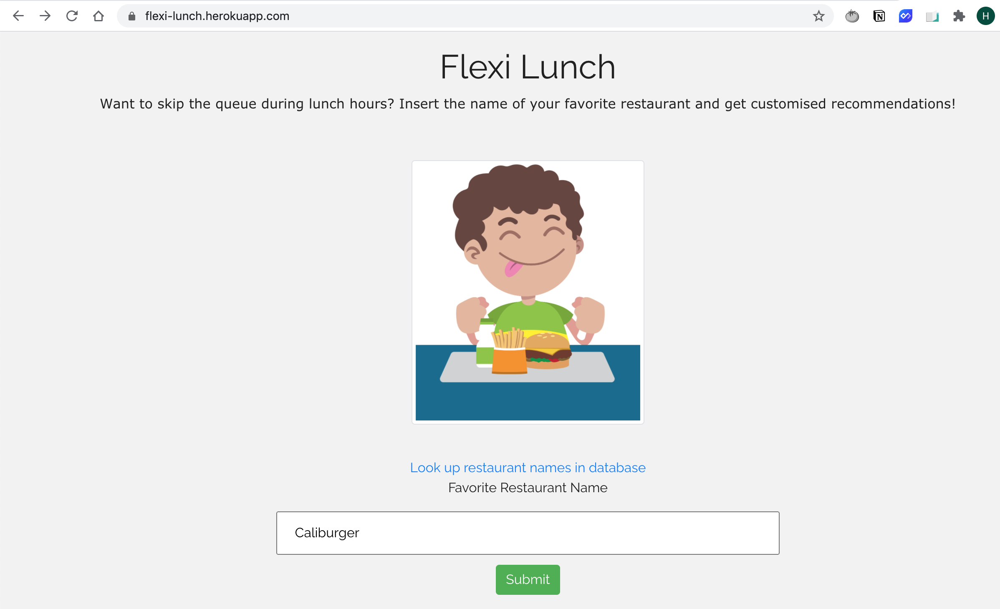
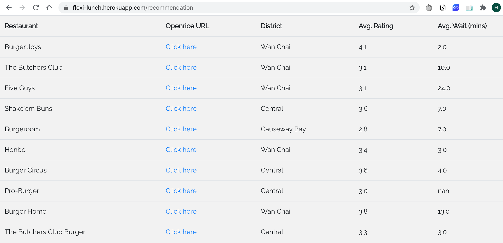

# Flexi Lunch App

An end-to-end Flask ML web app that recommends restaurants based on customer reviews similarity.

Visit the web app [here](https://flexi-lunch.herokuapp.com/).

### Requirements

```
pip install -r requirements.txt
```

### Dataset

This tool is built on my own web-scrapped dataset from [Openrice HK’s reviews page](https://www.openrice.com/en/hongkong/restaurant/review/index.htm?tc=bc) in 2019.

The dataset contains 2,600+ reviews on users' lunch experience of 900+ restaurants in Hong Kong's prime business districts of Central, Admiralty, Causeway Bay and Wan Chai.

For my previous code on web scrapping and text analysis, see [here](https://github.com/makhy/Flexi-Lunch-Tool).

### ML model: recommender system

The core ML model is content-based recommender system. It compares the `cosine similarity` of restaurants based on their customer reviews.

### Snapshots




